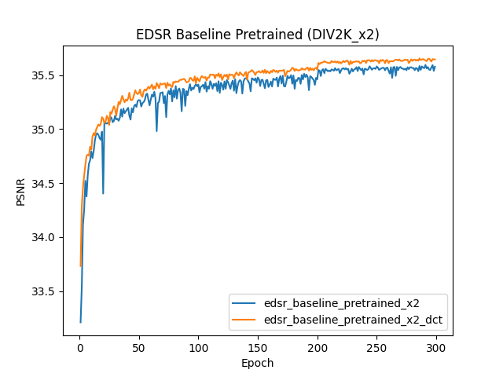
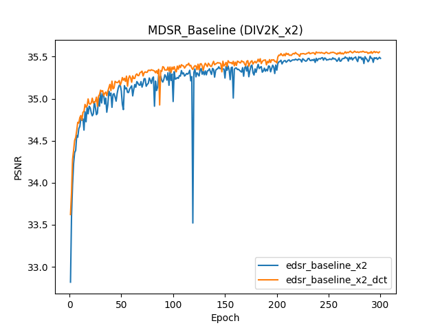
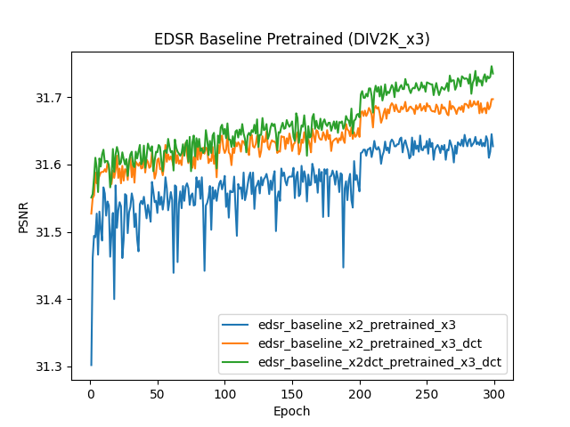
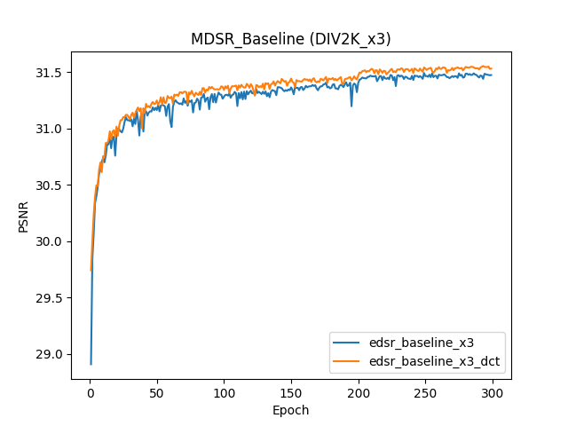
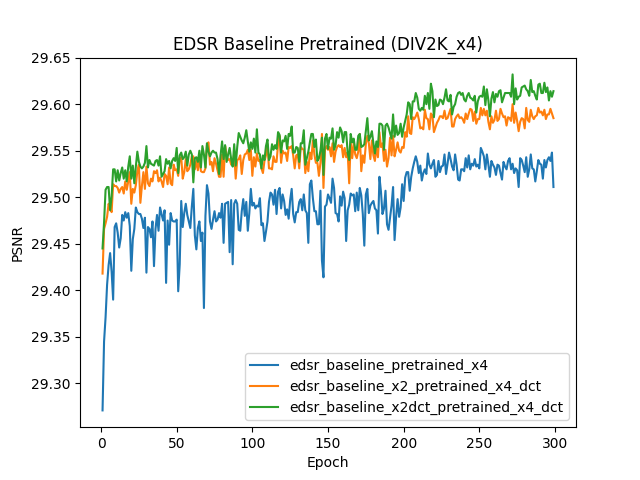
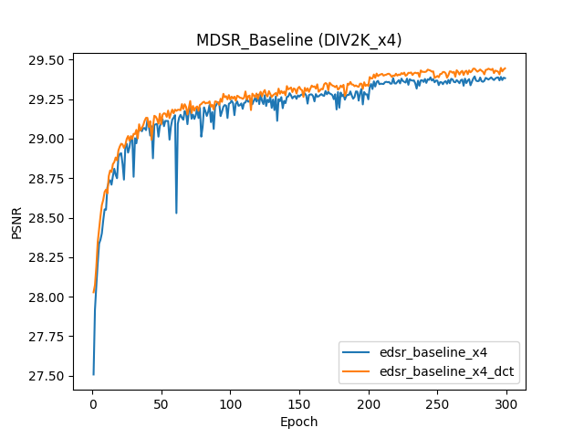

# pinn-dct-sr
## A PINN-Based DCT Function for Supervised Image Super-Resolution Networks.
First of all, I would like to thank Lim, Bee, Son, Sanghyun, Kim, Heewon, Nah, Seungjun, and Lee, Kyoung Mu for their contributions, which have facilitated my research. If you find their work useful, please cite their paper.

```bibtex
@InProceedings{Lim_2017_CVPR_Workshops,
  author = {Lim, Bee and Son, Sanghyun and Kim, Heewon and Nah, Seungjun and Lee, Kyoung Mu},
  title = {Enhanced Deep Residual Networks for Single Image Super-Resolution},
  booktitle = {The IEEE Conference on Computer Vision and Pattern Recognition (CVPR) Workshops},
  month = {July},
  year = {2017}
}
```

## Experimental Steps

### 1. Prepare Data and Environment
Prepare the data and set up the environment according to the requirements in the `README.md` of the source code at [https://github.com/thstkdgus35/EDSR-PyTorch](https://github.com/thstkdgus35/EDSR-PyTorch).

### 2. Run Training Commands
Run the following commands separately as in the `demo.sh` of the source code. Note to train them separately, and then comment the code in the `trainer` of this paper according to your needs.

```bash
python main.py --model EDSR --scale 2 --patch_size 96 --save edsr_baseline_x2 --reset

# EDSR baseline model (x3) - from EDSR baseline model (x2)
#python main.py --model EDSR --scale 3 --patch_size 144 --save edsr_baseline_x3 --reset --ext sep --pre_train [pre-trained EDSR_baseline_x2 model dir]

# EDSR baseline model (x4) - from EDSR baseline model (x2)
#python main.py --model EDSR --scale 4 --save edsr_baseline_x4 --reset --ext sep --pre_train [pre-trained EDSR_baseline_x2 model dir]

# MDSR baseline model
#python main.py --template MDSR --model MDSR --scale 2+3+4 --save MDSR_baseline --reset --save_models
```

### 3. Replace `src/trainer.py` and Retrain
Replace the original `trainer.py` with the one in this code. Rename the original file to `trainer_bak.py` for easy switching back. You can also use the original loss function by uncommenting the following three lines in `trainer.py`.

```python
#loss = self.loss(sr, hr)
physic_loss=self.dct_loss(sr,hr)
loss=physic_loss/100
```

Then run the following commands respectively:

```bash
python main.py --model EDSR --scale 2 --patch_size 96 --save edsr_baseline_x2_dct --reset

# EDSR baseline model (x3) - from EDSR baseline model (x2)
python main.py --model EDSR --scale 3 --patch_size 144 --save edsr_baseline_x3_dct --reset --ext sep --pre_train [pre-trained EDSR_baseline_x2 model dir]
```
Here, for `pre_train`, you can choose either the original `edsr_baseline_x2` or `edsr_baseline_x2_dct`, corresponding to the orange and green lines in Figure 5 of this paper respectively.

```bash
# EDSR baseline model (x4) - from EDSR baseline model (x2)
python main.py --model EDSR --scale 4 --save edsr_baseline_x4 --reset --ext sep --pre_train [pre-trained EDSR_baseline_x2 model dir]
```
Here, for `pre_train`, you can choose either the original `edsr_baseline_x2` or `edsr_baseline_x2_dct`, corresponding to the orange and green lines in Figure 7 of this paper respectively.

```bash
# MDSR baseline_dct model
python main.py --template MDSR --model MDSR --scale 2+3+4 --save MDSR_baseline_dct --reset --save_models
```
To facilitate the training process, this paper modified the template.py file by setting the number of epochs to 300 when training MDSR. Specifically, the following code snippet was added to the template.py file:
```bash
if args.template.find('MDSR') >= 0:
    args.model = 'MDSR'
    args.patch_size = 48
    args.epochs = 300
```
### Visualization of Training Experimental PSNR Results

The figure shows the PSNR comparison plots of EDSR_Baseline, EDSR_Baseline_DCT, MDSR_Baseline, and MDSR_Baseline_DCT during the training on the DIV2K validation set.

| Sub - figure Number | Sub - figure Description | Image |
| ---- | ---- | ---- |
| Figure 1 | EDSR_Baseline_X2 comparison | |
| Figure 2 | MDSR_Baseline_X2 comparison | |
| Figure 3 | EDSR_Baseline_X3 comparison | |
| Figure 4 | MDSR_Baseline_X3 comparison | |
| Figure 5 | EDSR_Baseline_X4 comparison | |
| Figure 6 | MDSR_Baseline_X4 comparison | |


### 4. PSNR Comparison Evaluation on Test Sets
The two sets of test commands separated by a blank line yield different PSNR and SSIM values for the first four datasets. The values from the first set of commands (above the blank line) are generally lower. The second set of commands (below the blank line) produces higher values, except for the DIV2K dataset, where the values are slightly lower due to the larger test set. However, this does not affect the comparison of the PINN-DCT method in this paper. The results in Table 3 of this paper are also obtained using the second set of commands below the blank line.
```bash
python main.py --model EDSR --data_test Set5+Set14+B100+Urban100+DIV2K --scale 2+3+4 --pre_train ../experiment/edsr_baseline_x4_dct_p/model/model_best.pt --test_only --save_results
python main.py --model MDSR --data_test Set5+Set14+B100+Urban100+DIV2K --scale 2+3+4 --pre_train ../experiment/MDSR_baseline_x4_dct_p/model/model_best.pt --test_only --save_results

python main.py --data_test Set5+Set14+B100+Urban100+DIV2K --data_range 801-900 --scale 2+3+4 --template EDSR --pre_train ../experiment/edsr_baseline/model/model_best.pt --test_only --self_ensemble
python main.py --data_test Set5+Set14+B100+Urban100+DIV2K --data_range 801-900 --scale 2+3+4 --template MDSR --pre_train ../experiment/MDSR_baseline/model/model_best.pt --test_only --self_ensemble
```

### 5. SSIM Comparison Evaluation on Test Sets
Modify the code according to the method in [https://github.com/HolmesShuan/EDSR-ssim](https://github.com/HolmesShuan/EDSR-ssim), or replace the original `utility.py` with the one in this code. Rename the original file to `trainer_bak.py` for easy switching back. You can also use the original loss function by uncommenting the following three lines in `src/utility.py`.

```python
# self.ckp.log[-1, idx_data, idx_scale] += utility.calc_psnr(
#     sr, hr, scale, self.args.rgb_range, dataset=d
# )
self.ckp.log[-1, idx_data, idx_scale] += utility.calc_ssim(
    sr, hr, scale, self.args.rgb_range, dataset=d
)

self.ckp.write_log(
                    #'[{} x{}]\tPSNR: {:.3f} (Best: {:.3f} @epoch {})'.format(
                    '[{} x{}]\SSIM: {:.3f} (Best: {:.3f} @ epoch {})'.format(
```
## Experimental Results Table by The first set of commands (up the blank line)
| Dataset       | Scale | EDSR_B       | EDSR_B_DCT    | MDSR_B       | MDSR_B_DCT    |
|---------------|-------|--------------|---------------|--------------|---------------|
| Set5          | X2    | 37.925/0.960 | 37.977/0.961  | 37.888/0.960 | 37.941/0.960  |
|               | X3    | 34.329/0.926 | 33.515/0.927  | 34.146/0.925 | 34.267/0.925  |
|               | X4    | 32.112/0.893 | 32.166/0.893  | 31.844/0.889 | 31.885/0.889  |
| Set14         | X2    | 33.521/0.917 | 33.515/0.917  | 33.436/0.916 | 33.461/0.917  |
|               | X3    | 30.306/0.842 | 30.346/0.842  | 30.197/0.839 | 30.207/0.839  |
|               | X4    | 28.567/0.781 | 28.586/0.781  | 28.414/0.777 | 28.445/0.777  |
| B100          | X2    | 32.129/0.899 | 32.135/0.900  | 32.102/0.899 | 32.088/0.899  |
|               | X3    | 29.070/0.805 | 29.086/0.805  | 28.981/0.803 | 28.993/0.803  |
|               | X4    | 27.560/0.736 | 27.581/0.737  | 27.440/0.732 | 27.471/0.733  |
| Urban100      | X2    | 31.869/0.926 | 31.916/0.926  | 31.722/0.925 | 31.706/0.924  |
|               | X3    | 28.101/0.852 | 28.120/0.851  | 27.737/0.844 | 27.776/0.844  |
|               | X4    | 26.002/0.784 | 26.071/0.784  | 25.646/0.772 | 25.684/0.772  |
| DIV2K validation | X2  | 35.594/0.946 | 35.654/0.946  | 35.506/0.945 | 35.565/0.946  |
|               | X3    | 31.645/0.884 | 31.746/0.885  | 31.493/0.882 | 31.555/0.882  |
|               | X4    | 29.553/0.830 | 29.632/0.831  | 29.394/0.827 | 29.448/0.828  |

## Experimental Results Table by The second set of commands (below the blank line) in Artical

| Dataset | Scale | EDSR_B | EDSR_B_DCT | MDSR_B | MDSR_B_DCT |
| ---- | ---- | ---- | ---- | ---- | ---- |
| **Set5** | X2 | 38.052/0.961 | 38.080/0.961 | 38.000/0.961 | 38.054/0.961 |
|  | X3 | 34.475/0.927 | 34.508/0.928 | 34.287/0.926 | 34.400/0.927 |
|  | X4 | 32.276/0.895 | 32.283/0.895 | 32.054/0.892 | 32.058/0.892 |
| **Set14** | X2 | 33.610/0.918 | 33.603/0.918 | 33.539/0.917 | 33.545/0.917 |
|  | X3 | 30.398/0.843 | 30.433/0.844 | 30.278/0.841 | 30.312/0.841 |
|  | X4 | 28.658/0.783 | 28.698/0.783 | 28.517/0.779 | 28.548/0.780 |
| **B100** | X2 | 32.192/0.900 | 32.191/0.900 | 32.174/0.900 | 32.151/0.900 |
|  | X3 | 29.142/0.807 | 29.149/0.807 | 29.046/0.804 | 29.054/0.804 |
|  | X4 | 27.617/0.737 | 27.639/0.738 | 27.503/0.734 | 27.533/0.735 |
| **Urban100** | X2 | 32.064/0.928 | 32.077/0.927 | 31.962/0.927 | 31.880/0.926 |
|  | X3 | 28.267/0.854 | 28.262/0.853 | 27.907/0.847 | 27.934/0.847 |
|  | X4 | 26.152/0.788 | 26.190/0.787 | 25.790/0.775 | 25.815/0.776 |
| **DIV2K validation** | X2 | 34.659/0.946 | 34.678/0.946 | 34.609/0.945 | 34.596/0.945 |
|  | X3 | 31.004/0.888 | 31.046/0.889 | 30.805/0.885 | 30.854/0.886 |
|  | X4 | 29.034/0.838 | 29.084/0.839 | 28.832/0.833 | 28.870/0.834 |

This table shows the PSNR/SSIM results of different models and different scales on each test set.
